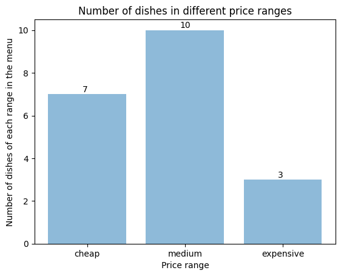
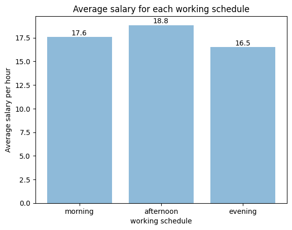

# Deliverable 3 (Group 62)

> Members: Weiming Guo, Hengxian Jiang, Yingjie Xu, Helen Ren

[TOC]

## Q1: Stored procedure

### Description: 

This function (Procedure) will train all the chef (i.e. increase the proficiency of the chef by one) below the function input `max_proficiency`. The function will take one input which is `max_proficiency`. All the chef with proficiency less than or equal to this `max_proficiency` will be trained. 

> Handling constraints: Since the proficiency of the chef is between 0 and 5, if the input `max_proficiency` is out of this range, no chef will be trained (i.e. the database remains unchanged)

### Procedure:

```sql
CREATE OR REPLACE FUNCTION train_all_the_chef(max_proficiency INTEGER)
RETURNS VOID AS $$
DECLARE
    rec_chef RECORD;
    cur_chefs CURSOR(max_proficiency INTEGER)
       FOR SELECT sid, proficiency 
       FROM chef
       WHERE proficiency <= max_proficiency;
BEGIN
   -- Open the cursor
    OPEN cur_chefs(max_proficiency);
 
	IF max_proficiency > 4 THEN
		RETURN;
	END IF;
	
    LOOP
        FETCH cur_chefs INTO rec_chef;
        EXIT WHEN NOT FOUND;
	UPDATE chef SET proficiency = proficiency + 1 WHERE sid = rec_chef.sid;
    END LOOP;
	
    -- Close the cursor
    CLOSE cur_chefs;
END;
$$ LANGUAGE plpgsql;
```

### Example (Test with valid input)

- Query before execution
  - We want to train all the chef with proficiency less than or equal to 3

```
cs421=> SELECT sid, proficiency FROM chef ORDER BY sid;
 sid | proficiency
-----+-------------
  13 |           2
  14 |           3
  15 |           3
  16 |           3
  17 |           4
  18 |           5
(6 rows)
```

- Execution of the procedure (Nothing is returned because the return type is void)

```
cs421=> SELECT FROM train_all_the_chef(3);
--
(1 row)
```

- Query after execution

```
cs421=> SELECT sid, proficiency FROM chef ORDER BY sid;
 sid | proficiency
-----+-------------
  13 |           3    <-- after training (increased by 1)
  14 |           4    <-- after training (increased by 1)
  15 |           4    <-- after training (increased by 1)
  16 |           4    <-- after training (increased by 1)
  17 |           4
  18 |           5
(6 rows)
```

### Example (Test with invalid input)

- Query before execution
  - We want to train all the chef with proficiency less than or equal to 6 (which is not a valid execution)
  - The expectation is that the table remains **unchanged**

```
cs421=> SELECT sid, proficiency FROM chef ORDER BY sid;
 sid | proficiency
-----+-------------
  13 |           2    <-- stay the same
  14 |           3    <-- stay the same
  15 |           3    <-- stay the same
  16 |           3    <-- stay the same
  17 |           4    <-- stay the same
  18 |           5    <-- stay the same
(6 rows)
```

- Execution of the procedure (Nothing is returned because the return type is void)

```
cs421=> SELECT FROM train_all_the_chef(6);
--
(1 row)
```

- Query after execution

```
cs421=> SELECT sid, proficiency FROM chef ORDER BY sid;
 sid | proficiency
-----+-------------
  13 |           2    <-- stay the same
  14 |           3    <-- stay the same
  15 |           3    <-- stay the same
  16 |           3    <-- stay the same
  17 |           4    <-- stay the same
  18 |           5    <-- stay the same
(6 rows)
```


---


## Q2: Application (JDBC program)

A video demo is recorded for this part. The java code named `RestaurantAdmin.java` for this application is also uploaded.


---


## Q3: Indexing

### a. Indexing on dish price

- Description & why this helps: 

We build the clustered index on `price` for dish relation because it sort on the price of the dishes. This will help execute SELECT statements based on price of dishes faster (specifically when we use the price range as our SELECT condition) as the matching tuples will only be clustered on a few data pages. 

- SQL statements:

```
cs421=> CREATE INDEX Iprice ON dish(price);
CREATE INDEX
cs421=> CLUSTER dish USING Iprice;
CLUSTER
```

- example query benefited from indexing:

```
cs421=> SELECT * FROM dish WHERE price < 50;
              dish_name              | price 
-------------------------------------+-------
 Sautéed Dark Beer Pork              |  28.9
 Breaded Cucumber & Lime Pizza       |  19.9
 Roasted Almonds & Avocado Bread     |  28.9
 Rum and Praline Delight             |  17.9
 Chestnut and Nutmeg Gingerbread     |  25.9
 Ginger Candy                        |  5.99
 Cranberry Genoise                   |    27
 Fire-Roasted Basil & Mint Yak       |  32.3
 Simmered Mountain Rabbit            |  22.5
 Pressure-Fried Vegetables & Frog    |  31.5
 Sautéed Orange & Mustard Vegetables |  26.9
 Barbecued Mustard & Garlic Calzone  |    25
 boiled spicy fish                   | 30.99
 Guoyou pork                         | 17.99
 Sweet and sour pork ribs            |  14.5
 beef pho                            |  10.5
 General Tsos Chicken                |  15.5
 Coconut chicken                     | 19.99
(18 rows)
```

### b. Indexing on reservation time slot

- Description & why this helps: 

We build index on `timeslot` for reservation relation because it will help when the the user want to find a specific time slot such as noon reservations or evening reservations. In this way, we could get better performance by using indexing. We do not need to scan through the whole table to find the corresponding timeslot.

- SQL statements:

```
cs421=> CREATE INDEX Itimeslot ON reservation(timeslot);
CREATE INDEX
```

- example query benefited from indexing:

```
cs421=> SELECT * FROM reservation WHERE timeslot = '12:20:00';
   rdate    | phone_number | timeslot 
------------+--------------+----------
 2020-01-25 | 514-421-1768 | 12:20:00
 2020-10-22 | 143-222-2222 | 12:20:00
(2 rows)
```


---


## Q4: Visualization

We used Jupyter Notebook for this part of the deliverable. The matplotlib library in Python is used to plot the bar chart.

[View our code and result graph on Google CoLab.](https://colab.research.google.com/drive/1N3ck6t2Ib-MlFnOCvvYOw3uwPriWEtpU) 

The `visualization.ipynb` file is uploaded. Required csv files for this part are `dish.csv` and `staff.csv`. The result images are `avg_salary.png` and `dish.png`.

### Visualization 1: Number of dishes in different price range

- We could show the number of dishes in different price ranges
- The definition of price range is:

| price range      | result    |
| :--------------- | :-------- |
| 0 < price < 20   | cheap     |
| 20 <= price < 40 | medium    |
| price > 40       | expensive |

- original data gathered by running the sql command and export table as `dish.csv`

```
cs421=> SELECT * FROM dish;
              dish_name              | price
-------------------------------------+--------
 Sautéed Dark Beer Pork              |   28.9
 Simmered Peas & Mushroom Oysters    |   66.6
 Breaded Cucumber & Lime Pizza       |   19.9
 Roasted Almonds & Avocado Bread     |   28.9
 Rum and Praline Delight             |   17.9
 Chestnut and Nutmeg Gingerbread     |   25.9
 Ginger Candy                        |   5.99
 Cranberry Genoise                   |     27
 Fire-Roasted Basil & Mint Yak       |   32.3
 Simmered Mountain Rabbit            |   22.5
 Pressure-Fried Vegetables & Frog    |   31.5
 Sautéed Orange & Mustard Vegetables |   26.9
 Barbecued Mustard & Garlic Calzone  |     25
 boiled spicy fish                   |  30.99
 Guoyou pork                         |  17.99
 Sweet and sour pork ribs            |   14.5
 beef pho                            |   10.5
 General Tsos Chicken                |   15.5
 Tenderized Truffles & Yak           | 56.089
 Tenderized Parmesan Lobster         | 109.89
(20 rows)
```

- code in Jupyter Notebook

```python
import csv
price_range = {"cheap": 0, "medium": 0, "expensive": 0}
with open('dish.csv', newline='') as csvfile:
  reader = csv.DictReader(csvfile)
  for row in reader:
    price = float(row['price'])
    if price < 20:
      price_range["cheap"] += 1
    elif price < 40:
      price_range["medium"] += 1
    else:
      price_range["expensive"] += 1

import numpy as np
import matplotlib.pyplot as plt

ranges = price_range.keys()
y_pos = np.arange(len(ranges))
number = price_range.values()

plt.bar(y_pos, number, align='center', alpha=0.5)
plt.xticks(y_pos, ranges)
plt.ylabel('Number of dishes of each range in the menu')
plt.xlabel('Price range')
plt.title('Number of dishes in different price ranges')

for i, v in enumerate(number):
  plt.text(i - 0.05, v + 0.1, str(v))

plt.show()
```

- result image:



### Visualization 2: Average salary of each working schedule

- We could show the average salary of each working schedule
- Average salary is calculated based on following formulas:

| Schedule  | avg_salary                                      |
| :-------- | :---------------------------------------------- |
| morning   | sum_salary['morning']/num_people['morning']     |
| afternoon | sum_salary['afternoon']/num_people['afternoon'] |
| evening   | sum_salary['evening']/num_people['evening']     |

- original data gathered by running the sql command and export table as `staff.csv`

```
cs421=> SELECT * FROM staff ORDER BY sid;
 sid |      sname       | working_schdule | salary
-----+------------------+-----------------+--------
   1 | Samuel Randall   | morning         |     21
   2 | Shala Tang       | morning         |     19
   3 | Macie Finely     | afternoon       |     21
   4 | Jeffrey Frye     | afternoon       |     12
   5 | Anna Black       | evening         |     21
   6 | Hugo Turner      | evening         |     12
   7 | Annie Carr       | evening         |     13
   8 | Cara Allenr      | morning         |     19
   9 | Jodie Stuart     | afternoon       |     19
  10 | Cassie Noble     | afternoon       |     21
  11 | Lachlan Lawrence | evening         |     19
  12 | Ammie Summers    | evening         |     13
  13 | Lacie Barr       | morning         |     16
  14 | Isla Greer       | morning         |     16
  15 | Meadow Moran     | afternoon       |     21
  16 | Steve Marwan     | afternoon       |     19
  17 | Luis Nash        | evening         |     21
  18 | Melanie Hill     | morning         |     19
  19 | leo              | morning         |     13
(19 rows)
```

- code in Jupyter Notebook

```python
import csv
num_people = {"morning": 0, "afternoon": 0, "evening": 0}
sum_salary = {"morning": 0, "afternoon": 0, "evening": 0}
with open('staff.csv', newline='') as csvfile:
  reader = csv.DictReader(csvfile)
  for row in reader:
    time = row['working_schdule']
    if time == 'morning':
      num_people['morning'] += 1
      sum_salary['morning'] += float(row['salary'])
    elif time == 'afternoon':
      num_people['afternoon'] += 1
      sum_salary['afternoon'] += float(row['salary'])
    else:
      num_people['evening'] += 1
      sum_salary['evening'] += float(row['salary'])
avg_salary = {"morning": sum_salary['morning']/num_people['morning'], 
              "afternoon": sum_salary['afternoon']/num_people['afternoon'], 
              "evening": sum_salary['evening']/num_people['evening']}

import numpy as np
import matplotlib.pyplot as plt

slot = avg_salary.keys()
y_pos = np.arange(len(slot))
number = avg_salary.values()

plt.bar(y_pos, number, align='center', alpha=0.5)
plt.xticks(y_pos, slot)
plt.ylabel('Average salary per hour')
plt.xlabel('working schedule')
plt.title('Average salary for each working schedule')

for i, v in enumerate(number):
  plt.text(i - 0.1, v + 0.2, str(round(v, 1)))

plt.show()
```

- result image:




---


## Q5: Creativity Point (visualization in Q4)

We explored the visualization on our own application. We used a library called matplotlib in Python to do the visualization of our data. 

[View our code and result graph on Google CoLab.](https://colab.research.google.com/drive/1N3ck6t2Ib-MlFnOCvvYOw3uwPriWEtpU) The .ipynb file is also uploaded.